# AYTKT21028en - Elements of AI - Building AI

## Summary

This is the final project for the Building AI course of the Building AI course created by Reaktor Innovations and University of Helsinki.

The goals of thisproject are to experimentally:

* Monitor the Galaxy for new exoplanet discoveries happening throughout the world
* Automatically classify the planets into populations
* Visualize the distributions of the findings onto various cross-sections of the multivariate data
* Automatically analyze singular values, principal components, or use some other similar or better algebraic, numeric or statistical procedures to suggest interesting cross-sections
* Alert subscribers for the updates, possibly detect anomalies

## Background

During the last couple of decades, numerous astronomical missions, both in space and on the ground, started reporting findings for objects of interest on a regular basis. Research teams then followed and double-checked the data, re-observed the phenomena and published the discoveries in batches. This resulted in somewhat scattered data ponds and lakes in a vast global data ocean of information on potential new worlds.

Various classes of the objects of interest (OIs) come from the various methodologies and equipment used to capture the data. Even though different features have been gathered for the classes, there are common must-have characteristics like physical (mass and size, hence density estimates) and orbital (host star type, period), and soon also chemical (atmosphere composition).

The problem of obtaining insights about the extrasolar worlds is relatively new, but it is here to stay. With the many existing and new space missions, some launching as soon as this year, and also terrestrial new telescope developments in Chile scheduled for first light in the next few years, the amount of information on the mentioned physical, orbital and chemical data is going to explode. Actually, in astronomy, information size has traditionally been astronomical.

The topic is of interest to many, for philosophical reasons at least.

## How is it used?

The current solution is to aid exploratory data analysis and also serve monitoring and alerting purposes. A potential user can be anyone interested in the current developments in extrasolar planet search.

The current space weather discipline, which today deals primarily with the varying conditions within the Solar System, and also some aspects of the effects of cosmic rays on it, will soon grow into an emergent "galactic weather" branch of astrophysics. Will be fun to watch.

This solution is a personal attempt at using experimental ML methods to illustrate applicaton to the astrobiology domain.

## To run the project

Under RStudio environment, source the "Exoplanets.R" file.

Under Visual Studio Code or similar IDE, run the "launch.sh" shell script to initiate the R environment execution.

## Data sources

[NASA Exoplanet Archive](https://exoplanetarchive.ipac.caltech.edu/)\
Main data source used currently

[About the Planetary Systems Composite Planet Data Table](https://exoplanetarchive.ipac.caltech.edu/docs/pscp_about.html)\
The Planetary Systems Composite Parameters Planet Data table (PSCompPars) is a compilation of system, stellar, and planetary parameters for known Confirmed Exoplanets. The purpose of this table is to enable a more statistical view of the known exoplanet population and their host environments.

[Elements of AI: Part II: Building AI](https://buildingai.elementsofai.com/)\
Final project of the Building AI course created by Reaktor Innovations and University of Helsinki

## ML/AI methods

[train: Fit Predictive Models over Different Tuning Parameters](https://www.rdocumentation.org/packages/caret/versions/5.16-24/topics/train)\
This function sets up a grid of tuning parameters for a number of classification and regression routines, fits each model and calculates a resampling based performance measure.

[qda: Quadratic Discriminant Analysis](https://www.rdocumentation.org/packages/MASS/versions/7.3-64/topics/qda)\
Quadratic Discriminant Analysis

[multinom: Fit Multinomial Log-linear Models](https://www.rdocumentation.org/packages/nnet/versions/7.3-20/topics/multinom)\
Fits multinomial log-linear models via neural networks.

[kmeans: K-Means Clustering](https://www.rdocumentation.org/packages/stats/versions/3.6.2/topics/kmeans)\
Perform k-means clustering on a data matrix.

[hist: Histograms](https://www.rdocumentation.org/packages/graphics/versions/3.6.2/topics/hist)\
The generic function hist computes a histogram of the given data values. If plot = TRUE, the resulting object of class "histogram" is plotted by plot.histogram, before it is returned.

## Challenges

The project is in no way aiming into completeness in aggregating all the information on the topic. It is targeted at being more of a summary on the many sources (or the most prolific of them).

Classifications results are most often a random variable. The next time you run classification algorithms, your results may differ. Some care will be taken as to how much stable the algorithms here are. The smaller the effect on the result when infinitesimally changing the initial conditions, the smaller a change should be expected.

Finally, results like the ones envisioned here can always come to be used with caution. Not in any way exhaustive, or predictive, they can anyway be a good tool for keeping an eye on exoplanet discovery developments. Remember, be in the loop, trust, but always check twice, your mileage may vary.

## What next?

This is an experimental project. It will be implemented as a small statistics tool, which will perform some unsupervised machine learning on a bunch of data sources. Initially the implementation will start with the R language, but later some Python might also come to help achieve the goals. Ideas welcome.

I imagine the day, in a few decades, when there will be regular reports on galactic weather in the same manner the space weather reports sometimes show on TV today.

## Acknowledgments

This research has made use of the NASA Exoplanet Archive, which is operated by the California Institute of Technology, under contract with the National Aeronautics and Space Administration under the Exoplanet Exploration Program.

## Various outputs

### Generic plot

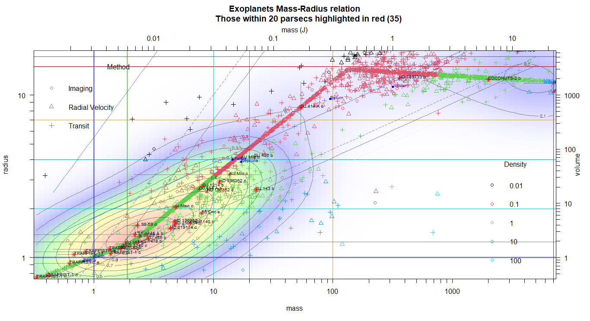

### By density

#### log_density

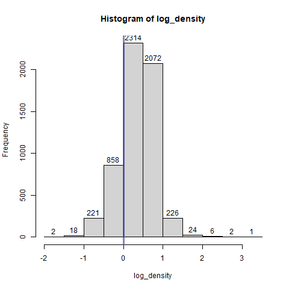

#### log_e_density

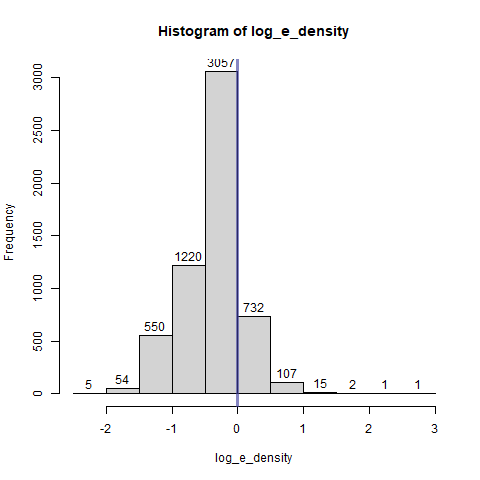

### By mass

#### log_mass_class_labels_multiline

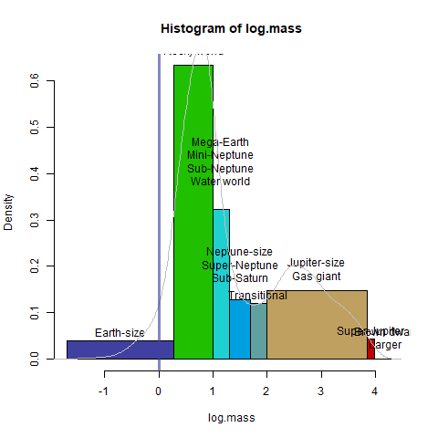

#### log_mass

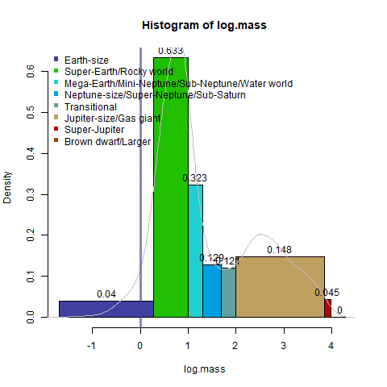

#### log_mass_freq

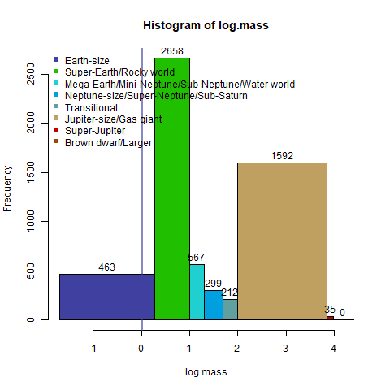

### By radius

#### pl_rade_log

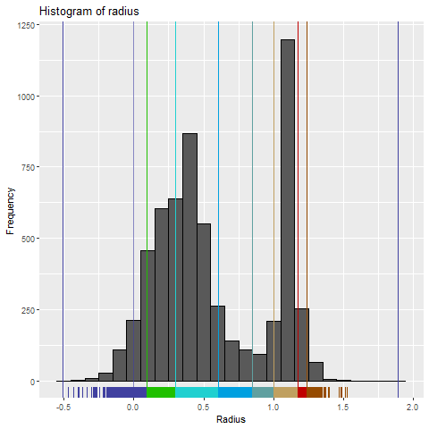

#### log_radius_class_labels_multiline

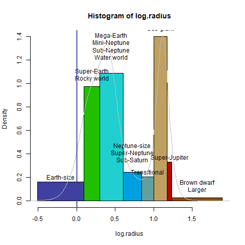

#### log_radius

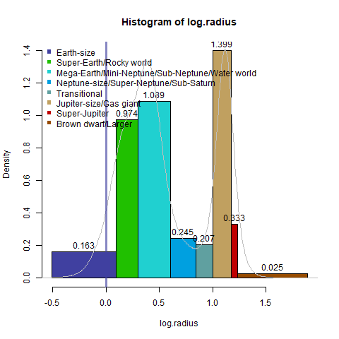

#### log_radius_freq

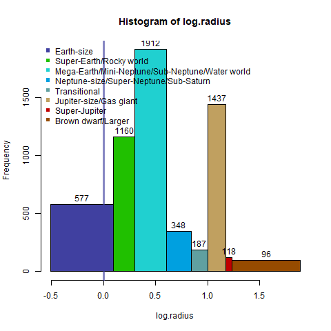

### Miscellaneous

#### pl_bmasse_log

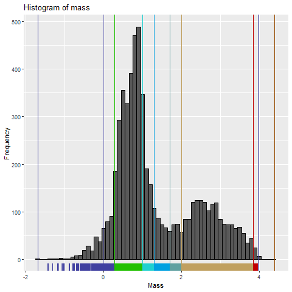

#### pl_rade

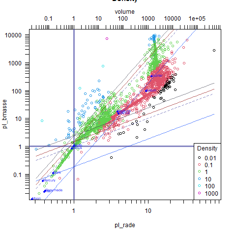

#### mr_relation

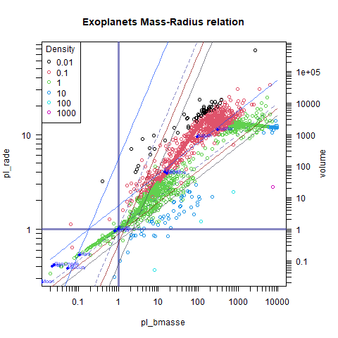

#### radius_mass

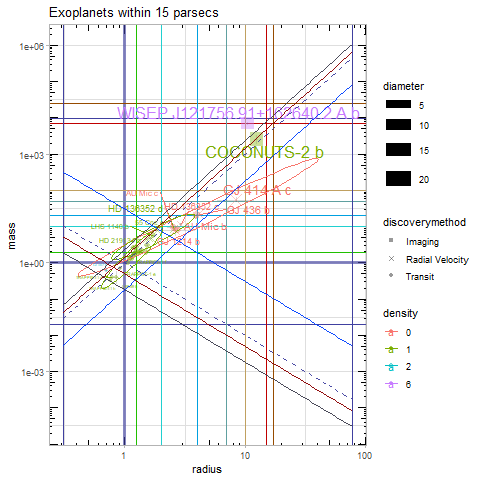

#### mass_radius

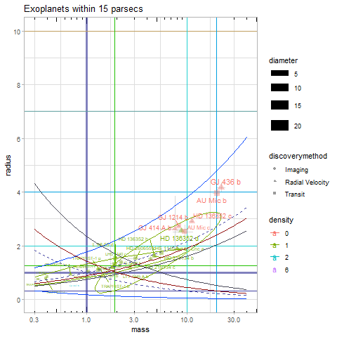

#### contour_plots

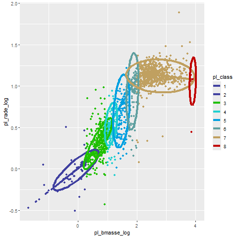
